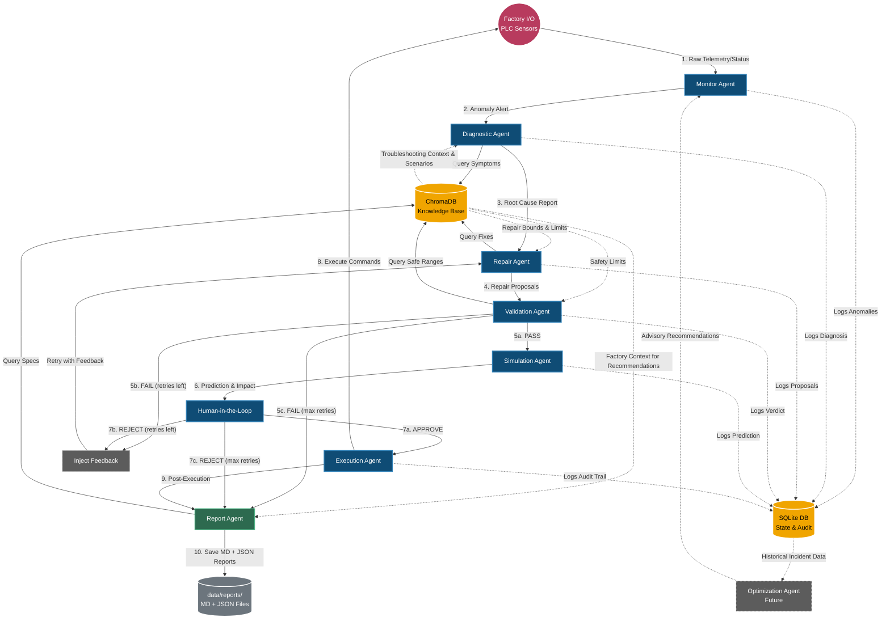
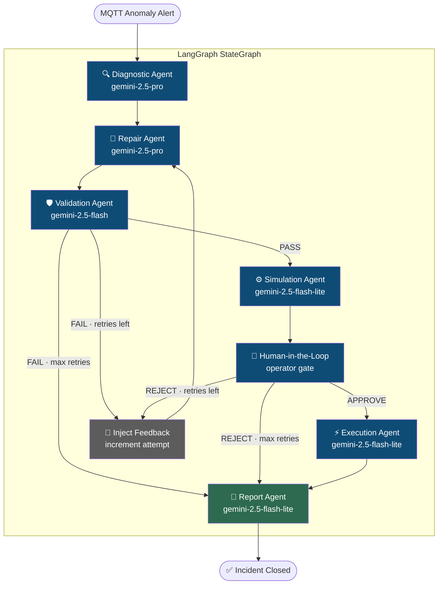
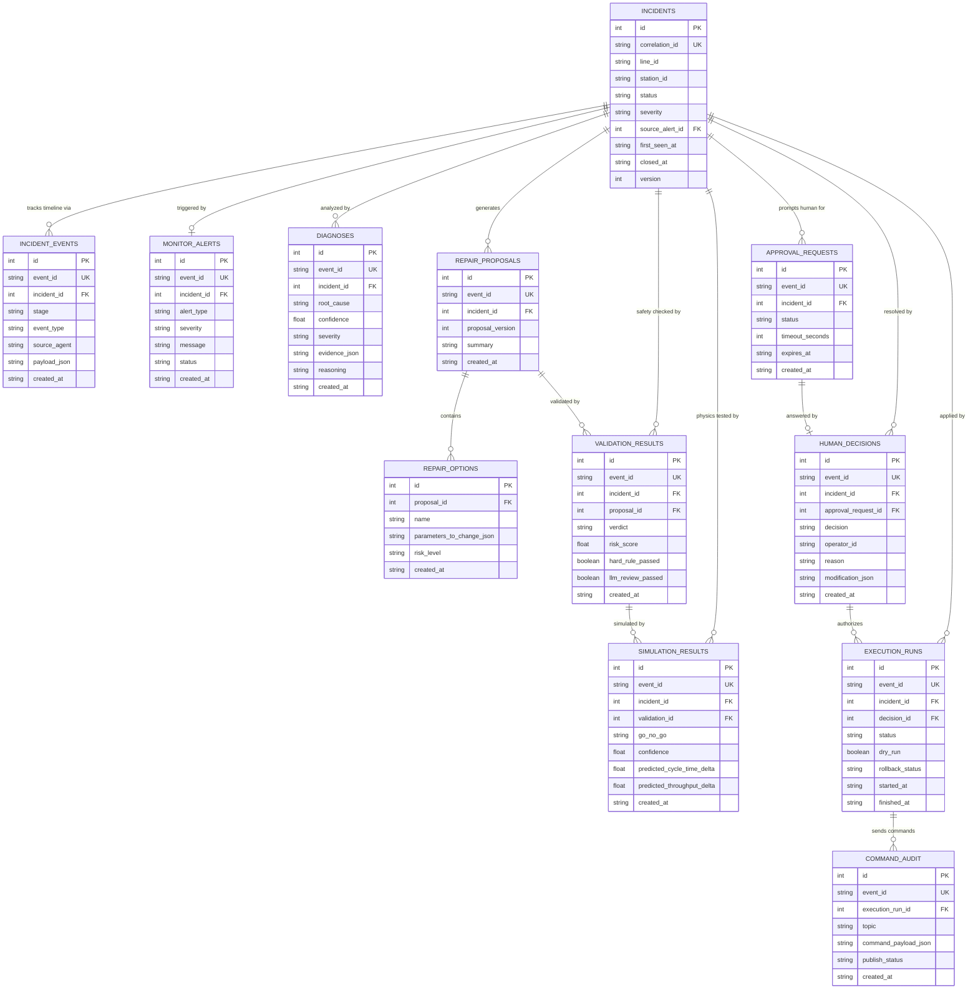
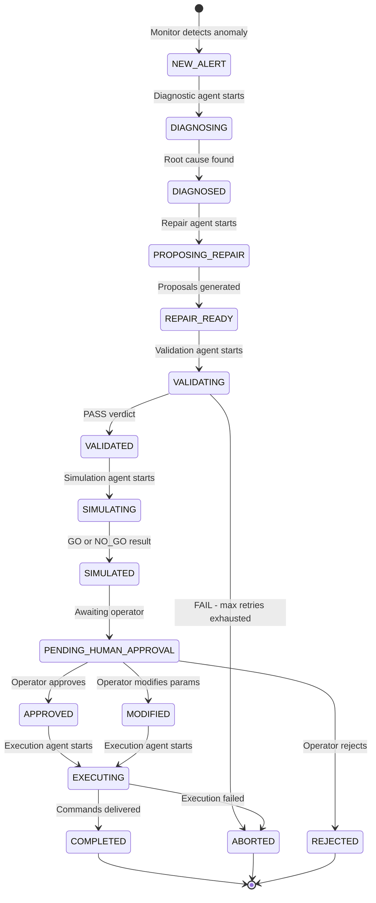
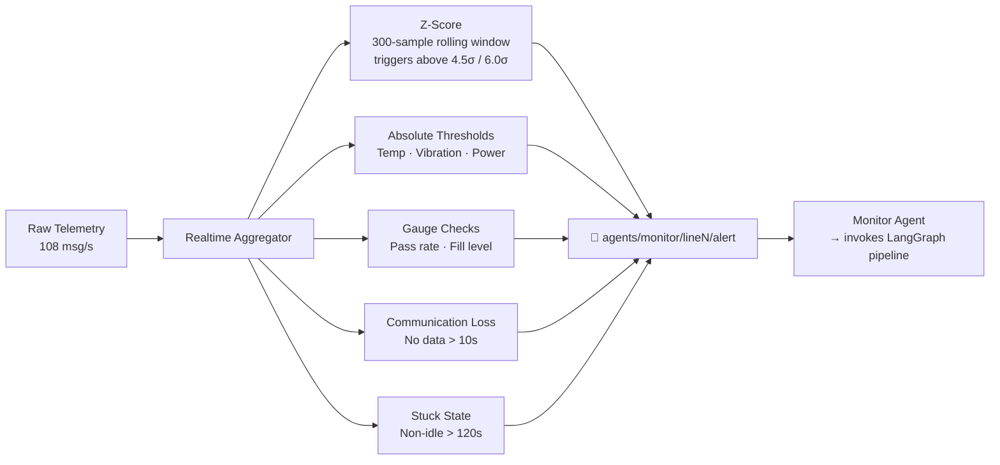

<div align="center">

# 🏭 MAESTRO

### Multi-Agent Engine for Smart PLC Troubleshooting and Repair Operations

*An autonomous AI pipeline that detects, diagnoses, simulates, and repairs industrial PLC faults — without human error, without guesswork.*

---

[](https://www.python.org/)
[](https://langchain-ai.github.io/langgraph/)
[](https://deepmind.google/technologies/gemini/)
[](https://www.trychroma.com/)
[](https://www.sqlite.org/)
[](https://mqtt.org/)
[](https://modbus.org/)
[](LICENSE)

</div>

---

## 🎓 Project Team

A graduation project submitted to the **Mechatronics Department, Faculty of Engineering, Fayoum University** in partial fulfillment of the requirements for the degree of Bachelor of Science in Mechatronics Engineering (Academic Year 2025–2026).

| Role | Name |
|------|------|
| Team member | Ahmed Hisham Gaballah |
| Team member | Menna Mohamed El Shahed |
| Team member | Aya Salah Kamal |
| Team member | Mohamed Khaled Korany |
| Supervisor | Assoc. Prof. Mokhtar Said |

---

## ⚡ The Problem MAESTRO Solves

Industrial PLC systems never stop generating telemetry — but fault detection and repair remain largely manual, slow, and expert-dependent. When a machining center overheats or a belt starts slipping, engineers scramble through manuals, guess at parameters, and hope the fix doesn't break something else.

**MAESTRO eliminates that gap.** It closes the loop from raw sensor anomaly to validated, simulated, human-approved parameter correction — autonomously, in minutes, with a complete audit trail of every decision.

---

## 🗺️ System Overview

MAESTRO is built on two tightly integrated layers:

| Layer | What it is | Technology |
|-------|-----------|-----------|
| **Digital Twin Factory** | Two parallel assembly lines driven by real Modbus TCP, streaming live telemetry over MQTT | Factory I/O · Python station controllers · pyModbusTCP · paho-mqtt |
| **AI Multi-Agent Engine** | 8 specialized agents orchestrated by LangGraph — from anomaly detection to executed repair | LangGraph · Google Gemini · ChromaDB · SQLAlchemy · SciPy |



---

## 📋 Table of Contents

- [Key Design Decisions](#-key-design-decisions)
- [AI Multi-Agent Pipeline](#-ai-multi-agent-pipeline)
  - [Agent Roster](#agent-roster)
  - [LangGraph Orchestration & Routing](#langgraph-orchestration--routing)
  - [The Retry Loop](#the-retry-loop)
  - [RAG Mechanism](#rag-mechanism)
- [Physics Simulation Engine](#-physics-simulation-engine)
- [Factory Digital Twin](#-factory-digital-twin)
- [Data Layer](#-data-layer)
  - [Entity Relationship Diagram](#entity-relationship-diagram)
  - [Incident State Machine](#incident-state-machine)
  - [DbRepository Guarantees](#dbrepository-guarantees)
- [Communication & Anomaly Detection](#-communication--anomaly-detection)
- [Tech Stack](#-tech-stack)
- [Project Structure](#-project-structure)
- [Getting Started](#-getting-started)
- [End-to-End Incident Trace](#-end-to-end-incident-trace)
- [Dashboard](#-dashboard)

---

## 🧠 Key Design Decisions

These architectural choices separate MAESTRO from a standard chatbot-on-top-of-sensors:

> **No LLM supervisor.** Routing between agents is deterministic — structural `conditional_edges` in LangGraph, not another model deciding what to do next. This makes the pipeline auditable, testable, and predictable.

> **Physics before execution.** A repair proposal clears safety validation AND passes a physics simulation (thermal ODE, belt dynamics, production throughput) before a human ever sees it. The human approves a prediction, not a gamble.

> **Idempotent writes everywhere.** Every database write is guarded by a unique `event_id`. Agents can retry tool calls without creating duplicate records — essential for LLM-based retry loops.

> **The digital twin IS the factory.** Factory I/O connects via real Modbus TCP. Faults have genuine physical consequences (belt stutter, emergency stops, brownout) visible in the 3D simulation. There is no mock.

---

## 🤖 AI Multi-Agent Pipeline

### Agent Roster

| # | Agent | LLM | Pattern | Role |
|---|-------|-----|---------|------|
| — | **Monitor** | None | MQTT daemon (out-of-graph) | Subscribes to anomaly alerts; triggers the pipeline |
| 1 | **Diagnostic** | Gemini 2.5 Pro (temp=0) | ReAct + structured output | Root cause analysis with RAG + evidence |
| 2 | **Repair** | Gemini 2.5 Pro (temp=0) | ReAct + structured output | Generates ≥2 repair proposals within safe parameter bounds |
| 3 | **Validation** | Gemini 2.5 Flash (temp=0) | ReAct + structured output | 5-check safety gate before physics test |
| 4 | **Simulation** | Gemini 2.5 Flash-Lite (temp=0) | ReAct + tool use | Physics engine + GO/NO_GO verdict |
| 5 | **Human-in-the-Loop** | None | Interactive gate | Operator APPROVE / REJECT / MODIFY |
| 6 | **Execution** | Gemini 2.5 Flash-Lite (temp=0) | Two-phase MQTT + audit | Publishes repair commands; logs complete audit trail |
| 7 | **Report** | Gemini 2.5 Flash-Lite (temp=0.2) | ReAct + narrative output | Writes MD + JSON incident report |

The **Monitor Agent** runs outside the compiled LangGraph graph as an always-on MQTT daemon. It detects anomalies and *invokes* the graph per incident — it is not a node within it.

---

### LangGraph Orchestration & Routing



**Routing functions are pure Python logic — not LLM calls:**

- `validation_router`: PASS → simulate · FAIL + retries → inject_feedback · FAIL + max_retries → report
- `human_router`: APPROVE → execute · REJECT + retries → inject_feedback · REJECT + max_retries → report

**MAX_REPAIR_ATTEMPTS = 3**

### The Retry Loop

When validation fails or an operator rejects a proposal, `inject_feedback`:
1. Increments the `repair_attempt` counter
2. Formats specific rejection feedback (validator concerns or operator reason)
3. Flows unconditionally back to the Repair Agent, which receives the feedback injected into its system prompt

This means each retry is informed — not a blind restart.

### Memory Layers

| Layer | Scope | Purpose |
|-------|-------|---------|
| `MemorySaver` | Per-incident thread | Pause/resume checkpointing |
| `InMemoryStore` | Cross-incident, per-station | Long-term learning from past repairs |
| SQLite audit tables | Permanent | Regulatory audit trail |
| ChromaDB | Knowledge base | Factory manuals and troubleshooting docs |

### RAG Mechanism

The Diagnostic, Repair, Validation, and Report agents all query ChromaDB before reasoning:

- **Embedding model:** `sentence-transformers/all-MiniLM-L6-v2`
- **Retrieval strategy:** MMR (Maximal Marginal Relevance) — `k=3, fetch_k=10, lambda_mult=0.8`
- **Chunking:** Semantic — split on `##` and `###` headers, with section context prepended to each chunk
- **Content:** Factory troubleshooting manual — fault signatures, safe parameter limits, repair procedures, cascade scenarios

---

## ⚙️ Physics Simulation Engine

Before any repair reaches a human for approval, it is run through three physics models. The Simulation Agent invokes `simulation/engine.py`, selecting models based on fault type:

| Fault Type | Models Activated |
|-----------|-----------------|
| `overheat` | ThermalModel + ProductionLineModel |
| `power`, `belt_slip`, `vibration` | BeltModel + ProductionLineModel |
| `sensor_drift`, `gripper_failure`, `vision_error`, `cnc_jam` | ProductionLineModel only |

**Three Physics Models:**

**ThermalModel** — 1st-order ODE numerically solved with `scipy.integrate.solve_ivp` (RK45):
```
dT/dt = α(T_target − T) − β · fan_boost · (T − T_amb)
```
→ GO if steady-state temperature after repair is below critical threshold AND below pre-repair temperature.

**BeltModel** — slip probability and effective speed:
```
v_eff = v_cmd × (1 − slip_duty − brownout_duty)
```
→ GO if belt efficiency improves and stays above 60%.

**ProductionLineModel** — bottleneck-limited throughput:
```
throughput = 60 / max(cycle_time_i)   [bottleneck station]
```
→ GO if throughput improves after repair.

**Verdict aggregation:** ANY model returning NO_GO → overall NO_GO. All GO → overall GO (averaged confidence). Otherwise → INCONCLUSIVE.

**Three-tier fallback strategy:**
1. Physics ODE engine (primary)
2. MQTT digital twin feedback (secondary)
3. Heuristic canned estimates (last resort)

---

## 🏗️ Factory Digital Twin

Two identical parallel assembly lines, each with 9 station controllers, all driven by real Modbus TCP to Factory I/O:

```
┌─────────────────── Line 1 (I/O: 0–55, Registers: 0–2) ──────────────────────┐
│                                                                               │
│  MC-A ──→ Stn1 ──→ Stn2 ──→ Stn3 ──→ Stn6 ──→ Stn7 ──→ Transfer ──→ WH    │
│  (Base)   (Load)  (PCB)   (Mount)   (QC)   (Sort)   (Palletize)  (Store)   │
│                     ↑                                                         │
│  MC-B ──────────────┘                                                         │
│  (Lid)                                                                        │
└───────────────────────────────────────────────────────────────────────────────┘
                        Line 2: identical structure, +100 I/O offset
```

**18 station controllers total (9 × 2 lines)**

| Station | Function | Simulated Sensors |
|---------|---------|-----------------|
| Machining Center A/B | CNC production (bases + lids) | Temperature, Vibration, Power |
| Station 1 | Chassis loading + optical inspection | All four |
| Station 2 | PCB board installation (Pick & Place) | All four |
| Station 3 | Display panel mounting (positioner) | All four |
| Station 6 | Quality control (vision sensor) | All four |
| Station 7 | Sorting (pass/fail pivot arm) | All four |
| Transfer | Product-to-pallet (2-axis P&P) | All four |
| Warehouse | 3-rack stacker crane (54 cells) | Production stats |

**Fault types with physical consequences:**

| Fault | Physical Effect |
|-------|----------------|
| `motor_overheat` | Belt stutters; emergency stop at severity ≥ 4 |
| `vibration_anomaly` | Blade chatter; intermittent belt stops |
| `power_fluctuation` | Brownout (outputs drop 0.5–2s); sensor misreads |
| `belt_slippage` | Reduced belt speed; intermittent stalls |
| `sensor_drift` | Wrong readings; missed product detection |
| `gripper_failure` | Lid dropped mid-transfer (Station 2) |
| `cnc_jam` | Machining paused (Machining A/B) |

Each station runs in its own thread. Adjacent stations coordinate via `threading.Event` signals; machining centers synchronize via `threading.Barrier(4)`.

---

## 🗄️ Data Layer

### Entity Relationship Diagram

17-table hub-and-spoke schema — every pipeline stage writes to its own child table, all linked back to `incidents` via `incident_id`:



**Additional auxiliary tables:** `agent_heartbeats`, `line_health_snapshots`, `optimizer_recommendations`, `rag_documents`, `rag_feedback`.

### Incident State Machine



**16 states total.** Every transition is an atomic database transaction: insert record → append event → update status.

### DbRepository Guarantees

The `DbRepository` (`core/repository.py`) is the only way agents touch the database. Every write call:

1. **Checks idempotency** — `filter_by(event_id=...).one_or_none()` before any insert. Duplicate writes are safely ignored.
2. **Auto-logs to `incident_events`** — every agent action is appended to the unified timeline without explicit coordination.
3. **Auto-transitions incident status** — writing a validation result automatically moves the incident to `VALIDATED` or `ABORTED`.
4. **Wraps in a single transaction** — ensure incident → insert record → append event → update status, all atomic.

**SQLite engine pragmas:**

```sql
PRAGMA journal_mode=WAL;      -- concurrent reads during writes (dashboard safety)
PRAGMA foreign_keys=ON;       -- strict referential integrity
PRAGMA synchronous=NORMAL;    -- balanced durability vs. performance
```

Schema is version-controlled by **Alembic** with `render_as_batch=True` (required for SQLite ALTER TABLE limitations).

---

## 📡 Communication & Anomaly Detection

~108 MQTT messages/second flow through the system at full production.

**Core MQTT topic taxonomy:**

| Topic Pattern | Publisher | Subscriber | Purpose |
|--------------|-----------|-----------|---------|
| `factory/line{N}/{station}/status` | Twin stations | Aggregator | Sensor snapshot (500ms) |
| `factory/line{N}/{station}/faults/event` | Fault manager | Logger | Fault inject/clear events |
| `agents/monitor/line{N}/alert` | **Aggregator** | **Monitor Agent** | **Anomaly alert → pipeline trigger** |
| `factory/{line}/{station}/commands/apply` | **Execution Agent** | Command handler | **Parameter repair commands** |
| `factory/{line}/{station}/commands/clear` | **Execution Agent** | Command handler | **Fault clear commands** |
| `factory/{station}/faults/inject` | inject_faults.py | Station controllers | Testing / demo |

The MQTT link is **bidirectional** — telemetry flows out, repair commands flow in.

**Anomaly detection methods in `realtime_aggregator.py`:**



The aggregator also enforces a **5-minute per-metric cooldown** on the Monitor Agent side to prevent alert storms on the same signal.

**Pre-built fault scenarios** for controlled testing (`runners/inject_faults.py`):

| Scenario | Description | Steps |
|----------|-------------|-------|
| 1. Thermal Cascade | Cooling system failure → sequential overheat | 11 |
| 2. Pneumatic Collapse | Contaminated compressed air → cylinder failures | 11 |
| 3. Power Grid Instability | Shared transformer voltage sags across both lines | 15 |
| 4. Mechanical Wear Chain | End-of-shift debris accumulation (Line 1) | 12 |

---

## 🧰 Tech Stack

| Category | Library | Version |
|----------|---------|---------|
| Orchestration | LangGraph | 1.0.10 |
| LLM Framework | LangChain | 1.2.10 |
| LLM Providers | Google Gemini (2.5-pro, flash, flash-lite), Groq Llama 3.3 70B | Multi-provider |
| Embeddings | sentence-transformers (all-MiniLM-L6-v2) | 5.2.3 |
| Vector Store | ChromaDB | Latest |
| ORM | SQLAlchemy | 2.0.48 |
| Migrations | Alembic (batch mode) | Latest |
| MQTT | paho-mqtt | 1.6.1 |
| Modbus | pyModbusTCP | 3.6.9 |
| Physics Simulation | SciPy + Matplotlib | ≥ 1.14.0 |
| Dashboard | Node.js + Vanilla HTML/JS/CSS frontend + Python API Bridge | 18.3 / HTML5 / CSS3 |
| Data | Pandas + NumPy | 2.3.3 / 2.4.3 |
| Validation | Pydantic | 2.12.5 |
| CLI/UX | Rich | 14.3.3 |
| Testing | pytest | 9.0.2 |
| Config | python-dotenv | 1.2.2 |

---

## 📁 Project Structure

```
Smart-PLC-Assistant/
│
├── agents/                        # All AI agent logic
│   ├── monitor_agent.py           # MQTT daemon — pipeline trigger (out-of-graph)
│   ├── supervisor_graph.py        # LangGraph StateGraph — pipeline definition & routing
│   ├── state.py                   # IncidentState TypedDict — shared pipeline contract
│   ├── nodes/                     # One file per in-graph agent node
│   │   ├── diagnostic_node.py
│   │   ├── repair_node.py
│   │   ├── validator_node.py
│   │   ├── simulation_node.py
│   │   ├── human_node.py
│   │   ├── execution_node.py
│   │   └── report_node.py
│   └── tools/
│       ├── mcp_client.py          # 14 database tools (LangChain @tool)
│       └── rag_tools.py           # search_factory_manual — ChromaDB MMR retrieval
│
├── core/
│   ├── repository.py              # DbRepository — all DB writes (idempotent, atomic)
│   ├── database.py                # SQLAlchemy engine config + WAL pragmas
│   └── rag_retriever.py           # ChromaDB ingestion + MMR search
│
├── simulation/
│   ├── engine.py                  # Simulation orchestrator — model selection + aggregation
│   ├── models/
│   │   ├── thermal_model.py       # 1st-order ODE (scipy.integrate.solve_ivp)
│   │   ├── belt_model.py          # Slip/brownout effective speed model
│   │   └── production_model.py    # Bottleneck-limited throughput model
│   ├── station_params.py          # Safe bounds + station type mappings
│   └── plotter.py                 # Simulation result visualizations
│
├── factory/
│   ├── modbus_client.py           # Modbus TCP I/O (read sensors, write actuators)
│   └── [station controllers]      # 9 station state machines per line (18 total)
│
├── runners/
│   ├── app.py                     # 🚀 Single-command system launch
│   ├── run_twin.py                # Digital twin runtime (2428 lines, all 18 stations)
│   ├── realtime_aggregator.py     # Anomaly detection → alert publisher
│   ├── mqtt_data_logger.py        # CSV archival of all factory telemetry
│   └── inject_faults.py           # CLI fault injection + 4 pre-built scenarios
│
├── mcp_server/
│   └── sqlite_mcp_server.py       # MCP protocol server (same 14 tools, stdio transport)
│
├── dashboard/
│   ├── server.js                  # Node.js web server
│   └── api_bridge.py              # Python ↔ Node.js data bridge
│
├── knowledge_base/
│   └── factory_troubleshooting_manual.md   # RAG source document
│
├── alembic/                       # Schema migrations (batch mode for SQLite)
├── config/                        # Settings + environment config
├── data/                          # Runtime output (DB, reports, plots, logs)
├── docs/                          # Architecture diagrams, Factory I/O screenshots
└── requirements.txt
```

---

## 🚀 Getting Started

### Prerequisites

- Python 3.11+
- Factory I/O (for full digital twin; skip with `--no-twin`)
- MQTT broker — Mosquitto recommended (`localhost:1883`)
- Google Gemini API key

### Installation

```bash
# Clone the repository
git clone https://github.com/AhmedGaballah28/Smart-PLC-Assistant.git
cd Smart-PLC-Assistant

# Create and activate a virtual environment
python -m venv .venv
source .venv/bin/activate        # Windows: .venv\Scripts\activate

# Install dependencies
pip install -r requirements.txt

# Configure environment
cp .env.example .env
# Edit .env — add GOOGLE_API_KEY, GROQ_API_KEY, MQTT broker settings

# Initialize the database and index knowledge base
python -m core.database          # creates data/plc_data.db with full schema
python -m core.rag_retriever     # embeds factory manual into ChromaDB
```

### Running the System

```bash
# Start everything with one command
python runners/app.py

# Options:
# --no-twin      Skip Factory I/O twin (no Modbus required — for AI-only testing)
# --no-logger    Skip CSV data logger
# --no-monitor   Skip Monitor Agent (LangGraph pipeline)
# --init-db      Force re-initialize database
# --data-dir DIR Custom output directory
```

**Startup order and timing:**

```
1. MQTT broker health check
2. SQLite DB initialization
3. MQTT Data Logger         [new window]  ← 2s settle
4. Realtime Aggregator      [new window]  ← 2s settle
5. Monitor Agent            [new window]  ← ~100s (embedding model load)
6. Digital Twin             [new window]  ← 3s settle
```

### Running a Demo

```bash
# Once all 5 windows are running, inject a fault scenario
python runners/inject_faults.py --scenario 1    # Thermal cascade

# Watch the Monitor Agent terminal — pipeline activates automatically
# Approve or reject the repair when prompted
# Check data/reports/ for the generated incident report
```

---

## 🔁 End-to-End Incident Trace

**Scenario:** Overheat injected into Machining Center A (Line 1, severity 3)

| Step | Component | Action | DB Write |
|------|-----------|--------|----------|
| 1 | `inject_faults.py` | Publishes fault command via MQTT | — |
| 2 | MC-A controller | Activates: temp +24°C, belt stutter | — |
| 3 | Telemetry Collector | Polls MC-A, publishes elevated readings | — |
| 4 | Realtime Aggregator | Z-score > 4.5 on temperature sensor | `monitor_alerts` |
| 5 | Monitor Agent | Cooldown check passes → invokes LangGraph | `incidents` (NEW_ALERT) |
| 6 | Diagnostic Agent | RAG + Gemini 2.5 Pro → root cause: coolant degradation | `diagnoses` (DIAGNOSED) |
| 7 | Repair Agent | Generates 2 proposals: reduce spindle speed / boost fan | `repair_proposals` + `repair_options` |
| 8 | Validation Agent | 5 safety checks → PASS · risk_score: 0.18 | `validation_results` (VALIDATED) |
| 9 | Simulation Agent | Thermal ODE: 78°C → 51°C predicted · GO · confidence 87% | `simulation_results` (SIMULATED) |
| 10 | Human Agent | Presents full summary → operator: APPROVE | `approval_requests` + `human_decisions` |
| 11 | Execution Agent | Publishes MQTT repair commands to MC-A | `execution_runs` + `command_audit` |
| 12 | Command Handler | Routes to MC-A controller, applies parameters | — |
| 13 | MC-A controller | Fault cleared, temperature begins recovering | — |
| 14 | Report Agent | Writes `data/reports/{id}.md` + `.json` | LangGraph store |

**Minimum DB rows written per incident: ~17** (8 domain records + 8 incident_events + 1 incident header)

**Possible incident outcomes:**

| Outcome | Condition |
|---------|-----------|
| `RESOLVED` | Execution succeeded |
| `EXECUTION_FAILED` | Commands sent but execution failed |
| `MAX_RETRIES_EXHAUSTED` | 3 repair attempts all failed validation |
| `REJECTED_BY_OPERATOR` | Human rejected at max retries |
| `VALIDATION_FAILED` | Validator rejected at max retries |
| `ABORTED` | Any other failure |

---

## 📊 Dashboard

The operator interface is a **Node.js** HTTP server (`dashboard/server.js`, no framework — built on `node:http`) serving a static, vanilla HTML/JS/CSS frontend (`dashboard/public/`). It never talks to SQLite or MQTT directly: every read and write is delegated to `dashboard/api_bridge.py`, spawned as a child process per request. The UI polls `GET /api/dashboard` every 4 seconds (`public/src/app.js`) rather than holding an open push connection, and a header strip (`flow.js`) renders the live pipeline as a left-to-right agent chain with a highlighted "current step."

**8 sidebar views** (`public/src/tabs.js`):

| Tab | What it shows |
|-----|---------------|
| Live Monitoring | Sensor gauges, temperature/speed/vibration trend charts, SQLite/project/incident status lights, a live agent + MQTT event stream |
| Alerts & Diagnosis | The human-approval gate (Approve / Reject / Modify buttons), an explainable-AI diagnosis card with a confidence meter, and the active alert list |
| Digital Twin | Per-line health table — health, units produced, rate, active faults, alert count — read from `line_health_snapshots` |
| Simulation Results | GO/NO_GO verdicts, confidence, predicted cycle-time / pass-rate / throughput / risk deltas, and repair-proposal cards |
| Analytics | OEE-style KPIs (produced, rate, active faults, open alerts) plus energy-consumption and event-frequency charts |
| Agent Activity Log | SQLite health, current incident state, an agent-heartbeat table, and a chronological event timeline |
| Fault Injection | One-click cards for the 4 pre-built scenarios, a manual command box (`<line><station>f<fault> <severity>`, e.g. `12f4 3`), an interactive-menu launcher, and a clear-all-faults control |
| Settings | Autonomy level, operator skill level, and validation/audit toggles — persisted to browser `localStorage`, not the database |

**API surface** (`server.js` routes → `api_bridge.py` actions):

| Endpoint | Action |
|----------|--------|
| `GET /api/dashboard` | `snapshot` — latest incident, alerts, diagnoses, pending approvals, simulations, repair proposals/options, agent heartbeats, straight from SQLite |
| `POST /api/human-decision` | `decision` — writes an APPROVE / REJECT / MODIFY verdict |
| `POST /api/start-project` | `start_project` — re-initializes the DB, then launches Data Logger, Realtime Aggregator, Digital Twin, and Monitor Agent as child processes in new terminal windows |
| `POST /api/stop-project` | `stop_project` — tears down the tracked process tree |
| `POST /api/inject-fault` | `inject_fault` — runs a scenario, a manual command, an interactive session, or clears all faults via `inject_faults.py` |

Node ≥ 18 is required (`package.json` `engines`); the server listens on port `4173` by default.

> **Note:** the graduation book's dashboard chapter describes telemetry as pushed to the browser over a WebSocket and documents an "Agent Reports" view. At the reviewed commit, the actual implementation uses 4-second polling with no WebSocket, and the 8th tab is **Fault Injection** rather than a reports view — the code, not the book, is reflected above.

---

## 🔑 Key Numbers

| Metric | Value |
|--------|-------|
| Agents in pipeline | 8 (1 daemon + 7 in-graph) |
| Max repair attempts | 3 |
| LLM tiers | 3 (Pro → Flash → Flash-Lite) |
| DB tools per agent | 14 |
| Memory layers | 4 |
| Physics models | 3 (Thermal · Belt · Production) |
| Validated PLC parameters | 7 (documented safe bounds) |
| Validation checks | 5 |
| Database tables | 17 |
| Incident status states | 16 |
| MQTT messages/sec | ~108 at full production |
| Station controllers | 18 (9 per line) |
| Fault scenarios (built-in) | 4 |

---

## 🔭 Future Work

- **Optimization Agent** — offline analysis of historical incident data to suggest proactive parameter tuning before faults occur
- **Real PLC hardware integration** — replace Factory I/O with physical Siemens/Allen-Bradley hardware
- **Async human-in-the-loop** — full `interrupt()`-based LangGraph pause/resume for web-based approval UI
- **RAG feedback loop** — use `rag_feedback` table to improve retrieval quality over time
- **Reinforcement from incident history** — route `InMemoryStore` summaries back into Repair Agent prompts for cross-incident learning

---

<div align="center">

Built as a graduation project in Mechatronics Engineering — demonstrating that autonomous industrial AI is not a future concept, it is an engineering problem with a working solution.

</div>