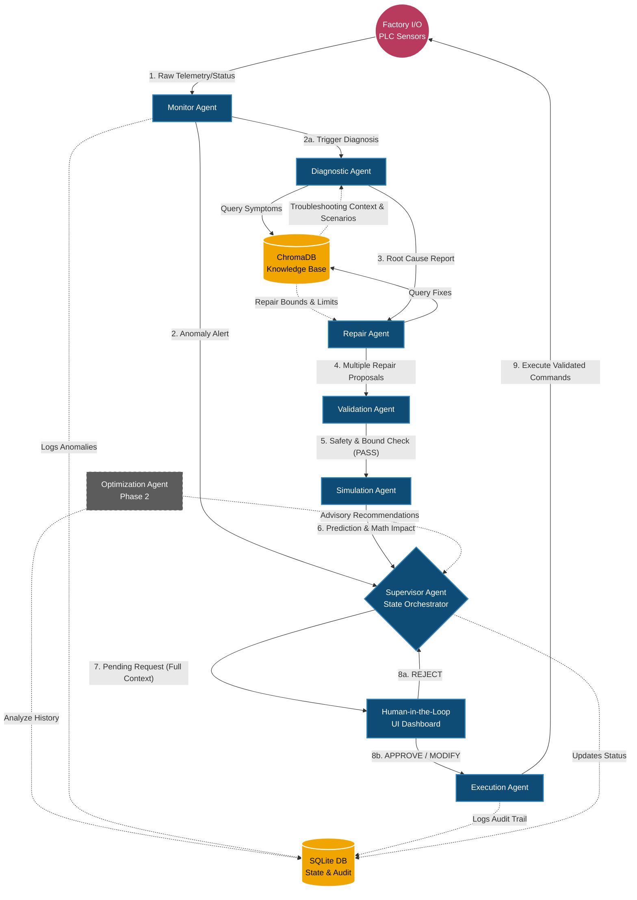

# Smart PLC Assistant: Agent Architecture & Flow

This diagram illustrates how the 8 core agents (and 1 optional agent) connect to each other, the factory, and the databases.

```mermaid
graph TD
    %% Define External Components
    Factory((Factory I/O\nPLC Sensors))
    SQLite[(SQLite DB\nState & Audit)]
    VectorDB[(ChromaDB\nKnowledge Base)]

    %% Core Agents
    Monitor[Monitor Agent]
    Diagnostic[Diagnostic Agent]
    Repair[Repair Agent]
    Validation[Validation Agent]
    Simulation[Simulation Agent]
    
    %% Management & Execution
    Supervisor{Supervisor Agent\nState Orchestrator}
    Human[Human-in-the-Loop\nUI Dashboard]
    Execution[Execution Agent]
    
    %% Phase 2
    Optimizer[Optimization Agent\nPhase 2]

    %% Real-time Monitoring Flow
    Factory -- "1. Raw Telemetry/Status" --> Monitor
    Monitor -- "2. Anomaly Alert" --> Supervisor
    Monitor -- "2a. Trigger Diagnosis" --> Diagnostic
    
    %% RAG Connections
    Diagnostic -- "Query Symptoms" --> VectorDB
    VectorDB -. "Troubleshooting Context & Scenarios" .-> Diagnostic
    Repair -- "Query Fixes" --> VectorDB
    VectorDB -. "Repair Bounds & Limits" .-> Repair
    
    %% Core Intelligence Pipeline
    Diagnostic -- "3. Root Cause Report" --> Repair
    Repair -- "4. Multiple Repair Proposals" --> Validation
    Validation -- "5. Safety & Bound Check (PASS)" --> Simulation
    Simulation -- "6. Prediction & Math Impact" --> Supervisor
    
    %% Approval & Execution Flow
    Supervisor -- "7. Pending Request (Full Context)" --> Human
    Human -- "8a. REJECT" --> Supervisor
    Human -- "8b. APPROVE / MODIFY" --> Execution
    Execution -- "9. Execute Validated Commands" --> Factory
    
    %% Optimization
    Optimizer -. "Analyze History" .-> SQLite
    Optimizer -. "Advisory Recommendations" .-> Supervisor
    
    %% Database Writes (Simplified)
    Monitor -. "Logs Anomalies" .-> SQLite
    Execution -. "Logs Audit Trail" .-> SQLite
    Supervisor -. "Updates Status" .-> SQLite
    
    %% Styling
    classDef agent fill:#0f4c75,stroke:#3282b8,stroke-width:2px,color:#fff;
    classDef factory fill:#b83b5e,stroke:#fff,stroke-width:2px,color:#fff;
    classDef db fill:#f0a500,stroke:#fff,stroke-width:2px,color:#000;
    classDef optional fill:#5c5c5c,stroke:#fff,stroke-width:1px,color:#fff,stroke-dasharray: 5 5;
    
    class Monitor,Diagnostic,Repair,Validation,Simulation,Human,Execution,Supervisor agent;
    class Factory factory;
    class SQLite,VectorDB db;
    class Optimizer optional;
```
